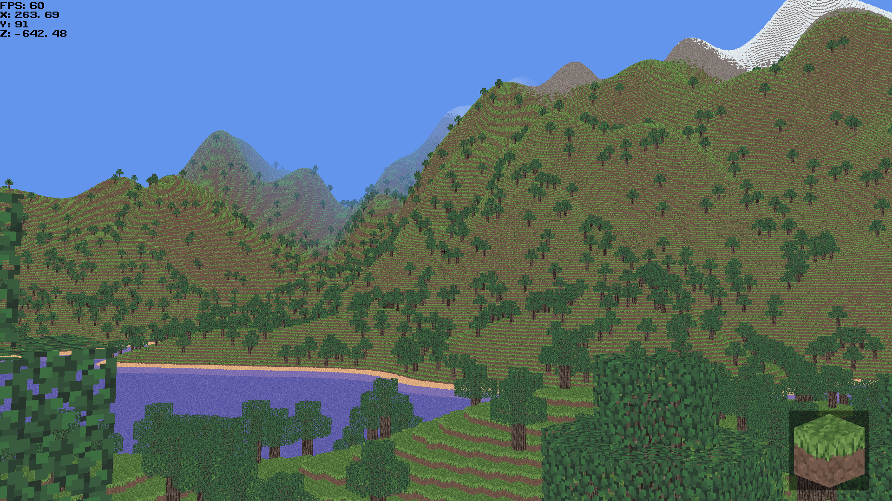

# VoxelTechDemo
Voxel tech demo with infinite world generation and ability to build written in c# using [MonoGame](https://github.com/MonoGame/MonoGame) for learning purposes.

# Credits
Textures - [VoxeLibre](https://git.minetest.land/VoxeLibre/VoxeLibre) 
Font - [Public Pixel](https://ggbot.itch.io/public-pixel-font) 
Noise - [OpenSimplex2](https://github.com/KdotJPG/OpenSimplex2) 